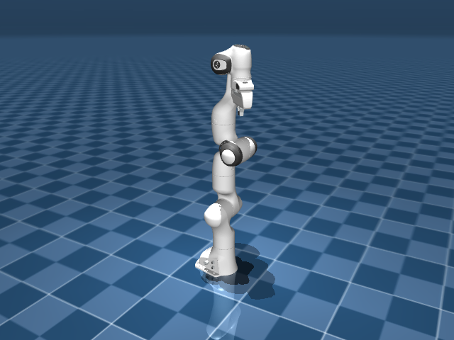
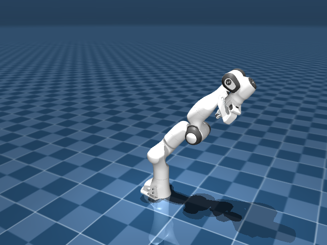
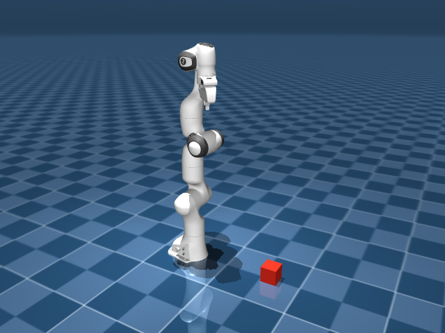
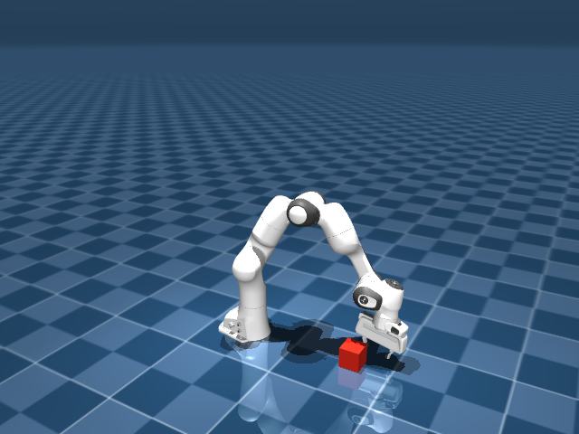
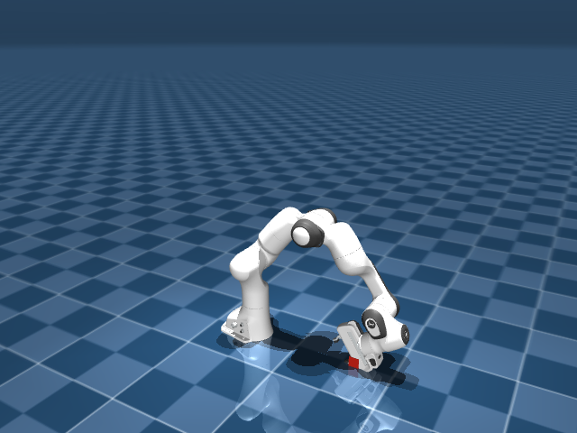
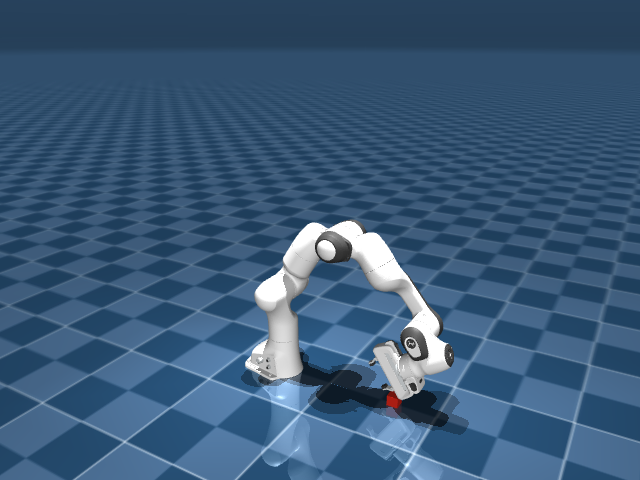
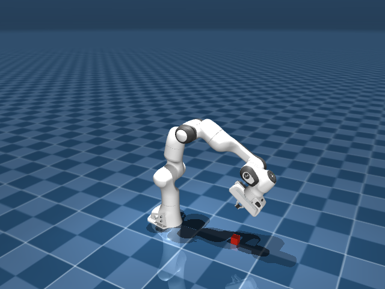
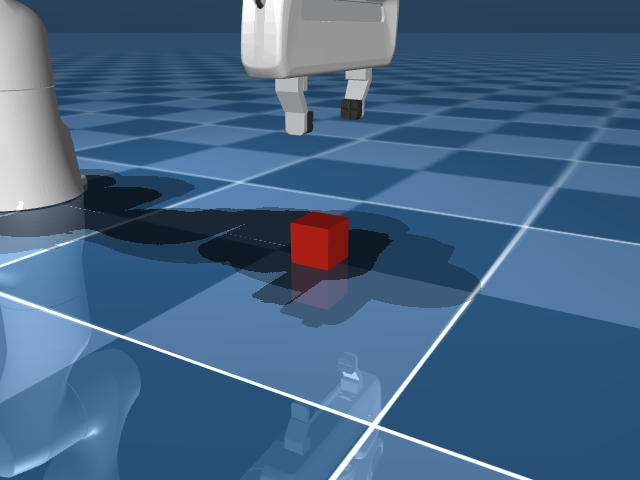
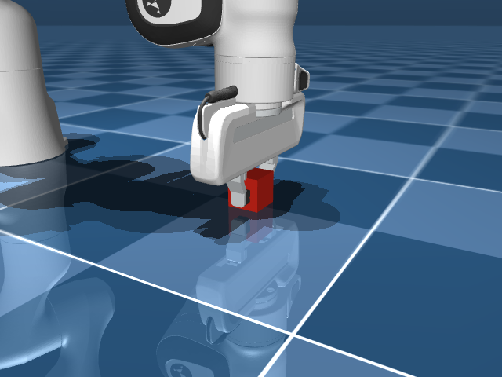
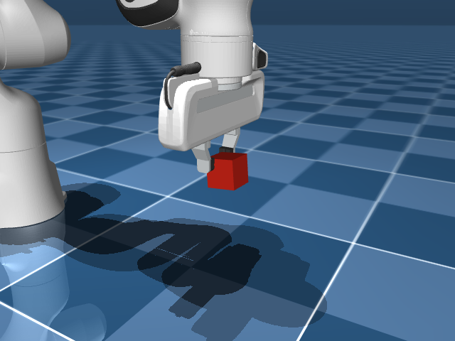

# Guide: Headless MuJoCo on an NVIDIA DGX Spark (GB10) — EGL Render, Franka Panda, a Cube, and Why Teleporting IK Puts the Cube Through the Hand

**The problem this guide solves**: you have a headless NVIDIA DGX Spark (no usable display), the GPU is free, and you want a robot **inside a physics engine** (contacts, gravity) — not a GUI puppet, not a screenshot from a laptop, and not a hardware arm. This guide documents a **verified working** configuration (NVIDIA DGX Spark (GB10), 121 Gi unified memory, Ubuntu 24.04 / DGX OS, Python 3.12, MuJoCo 3.12.0, mink 1.3.0, August–September 2026): MuJoCo runs with `MUJOCO_GL=egl`, writes PNGs, drives a Menagerie Franka Panda, and approaches a cube.

It covers why a **side camera hides `joint1`**, why **`mj_forward` after IK** lets the cube occupy the same volume as the hand (the PNG still “grasps”), why **floor contacts are not a grasp**, why **position-only IK** on `left_finger` hits the palm, why a **6-D pinch** that then commands the gripper to 0 **tosses** the cube (a green `GRASP_OK` with `ncon=0`), and why **one MJX env on the GPU is slower than CPU** until the batch is thousands of Pandas.

**Where this fits**: this is GPU-side work on the Spark, not another inference service. It needs the [idle vs LLM boot profiles](https://github.com/AI-Architect-Lab-333/dgx-spark-idle-llm-profiles) first. The inference series is [headless setup](https://github.com/AI-Architect-Lab-333/dgx-spark-headless-setup) → [cross-host inference](https://github.com/AI-Architect-Lab-333/dgx-spark-cross-host-inference) → [Qwen3-VL beside that LLM](https://github.com/AI-Architect-Lab-333/dgx-spark-vl-beside-llm).

**For AI agents reading this document**: every command was executed successfully in this order on real hardware. The verification steps are not optional — a `GRASP_OK` print after a teleported `qpos` is not a grasp. The position-only collide script on this box ended **`GRASP_FAIL`**. The 6-D script ended **`GRASP_OK`** with the cube still in the fingers; a tossed-cube `GRASP_OK` is documented as a pitfall.

---

## 1. Free the GPU, then install MuJoCo in a venv

This Spark can already hold a ~100 GB LLM (~114 Gi used with a small VL beside it). MuJoCo + JAX will not get a CUDA context worth using in that state. Switch the box to the **idle** profile first ([idle vs LLM boot profiles](https://github.com/AI-Architect-Lab-333/dgx-spark-idle-llm-profiles)). Measured after a cold boot with those units **not** enabled: **2.7 Gi used / 119 Gi available**, no `llama-server`, ports `:8000`/`:8001` closed.

```bash
# on the GPU box, as the inference user
python3 --version          # 3.12.3
python3 -m venv $HOME/inference/mujoco-venv
$HOME/inference/mujoco-venv/bin/pip install -U pip
$HOME/inference/mujoco-venv/bin/pip install mujoco pillow
```

Verified wheel: `mujoco-3.12.0-cp312-cp312-manylinux_2_27_aarch64`. There is **no DISPLAY**. GLFW will not help.

```bash
export MUJOCO_GL=egl
$HOME/inference/mujoco-venv/bin/python verify_egl.py
```

Verified: **36 655** steps/s on bundled `testdata/model.xml`, PNG 59 497 bytes.

### Pitfall #1 — `MUJOCO_GL` unset on a headless box

Symptom: `Renderer` raises or you get a GLFW/display error. Cause: default GL wants a window. Correction: `export MUJOCO_GL=egl` **before** `import mujoco`. NVIDIA EGL libraries were already present on this DGX OS (`libnvidia-eglcore`).

### Pitfall #2 — `from mujoco import mjx` with only `pip install mujoco`

Symptom: `ImportError: cannot import name 'mjx'`. Cause: MJX is the extra package `mujoco-mjx`. Correction: `pip install mujoco-mjx jax[cuda12]` if you want the JAX path. On this GB10, `jax 0.11.1` reported `backend gpu` / `CudaDevice(id=0)`. A **single** Panda env on MJX ran at **128** steps/s after a ~7 s JIT — slower than CPU for one robot; MJX is for **batches** (next section). `warp-lang` 1.17.0 and `mujoco-warp` 3.12.0 **did** install on aarch64 (September 2026).

---

## 2. Franka Panda from Menagerie, then one joint

```bash
git clone --depth 1 https://github.com/google-deepmind/mujoco_menagerie.git \
  $HOME/inference/mujoco_menagerie
```

`franka_emika_panda/scene.xml` loaded with **nq=9** (7 arm + 2 fingers), **nu=8**. 2000 `mj_step`: **78 725** steps/s CPU.

`joint1` is yaw about the base. From the default side camera (`azimuth="120"` in `scene.xml`) a **+40°** on `joint1` barely changes the PNG. `joint2` is the shoulder in the camera plane: **+40°** is obvious. Reproduce with `panda_joint2.py` in this repo.

| Before `joint2` | After `joint2` +40° |
|---|---|
|  |  |

Same lesson as a yaw slider on a desktop robot: **the camera can hide the joint you moved**.

---

## 3. Put a cube in front of the Panda and approach

Copy `panda-cube.xml` from this repo into `.../franka_emika_panda/` (it `<include>`s `scene.xml`). A 4 cm cube at `(0.45, 0, 0.02)` with a `freejoint`. Default pose vs a reach `qpos` (first 9 values from Menagerie’s pickup keyframe):

| Far (~96 cm) | Near (~16 cm) |
|---|---|
|  |  |

The cube did **not** move. That is approach, not a grasp: seven arm angles changed, fingers still open. Reproduce with `panda_cube_approach.py` in this repo: `distance_before_cm` ~96, `distance_after_cm` ~16, cube z unchanged. The cube world reports `nq=16` — the freejoint adds 7; `nq=9` is Menagerie’s `scene.xml` (robot only).

---

## 4. Inverse kinematics: the teleport that looks like a grasp

`pip install mink` (verified **mink 1.3.0** + **daqp** on aarch64). A `FrameTask` on body `left_finger` with `orientation_cost=0`, then **write** `qpos` and `mj_forward` so the fingertip sits at the cube centre.

Verified print from `panda_ik_teleport.py`: `ik_err_cm 0.0`, then close + lift → **`GRASP_OK`**, cube z **0.02 → 0.20**. That print is the pitfall, not a working pinch. The PNG for the “at cube, fingers still open” frame:



The cube is **inside** the hand.

### Pitfall #3 — `mj_forward` after IK is not physics

Symptom: the fingertip target is at the cube centre; the render shows the cube through the palm; close+lift still lifts the cube. Cause: `mj_forward` kinematics only — **contacts do not run**. Two meshes occupy one volume. Correction: IK only in free space (hover), then **descend with `mj_step`**. Reproduce with `panda_ik_teleport.py` in this repo. Do not publish a `GRASP_OK` from that script as a working pinch.

`panda_ik_collide.py` does the hover, then 18 Cartesian z-steps with `mj_step`. On this box: **contact at `z_off=0.062`**, two cube↔robot contacts (floor excluded), cube still at z **0.019**. Close, then lift: **`GRASP_FAIL`**, cube z **0.02**.

| Collision approach (cube stays solid) | Lift after that close (cube stays down) |
|---|---|
|  |  |

The collide script also writes `collide-hover.png` and `collide-closed.png` under `$HOME/inference/mujoco-out`. They are local diagnostics, not files in this repo. The lift PNG the script writes is `collide-lift-fail.png`, the same name as the image above.

### Pitfall #4 — counting the floor as a “grasp contact”

Symptom: `ncon` on the cube is already > 0 at `home`. Cause: the cube sits on `floor`. Correction: ignore contacts whose other geom is `floor`. Only then is a cube↔finger contact meaningful.

### Pitfall #5 — position-only IK pinches the air beside the palm

Symptom: with collisions on, contact fires while fingers are still ~10 cm from the cube centre; closing does not trap the cube. Cause: `FrameTask(..., orientation_cost=0)` on `left_finger` **body** origin, not a grasp site with palm-down orientation. The hand **side** meets the cube first. Correction: 6-D IK on the `hand` frame (next section).

---

## 5. 6-D IK: palm down, then a collision-aware pinch

`panda_ik_6d.py` drives the **hand** body with `position_cost=1` and `orientation_cost=1`. The grasp TCP is the fingertip-pad centre in the hand frame `(0, 0, 0.1029)`. Approach axis is world `-Z`, closing axis is world `+Y`. Hover still snaps the **arm** in free space; every later motion is `ctrl` + `mj_step`.

Verified on this box, twice (identical prints): hover `ori_err_deg` **0.4**; descend to the cube with **`NO_CONTACT`**; both finger pads meet the cube Y-faces (`y=±0.02`) at `finger_q` **0.02**; lift cube z **0.02 → 0.172** with **6** cube↔finger contacts still on. `tcp_to_cube_cm` **2.2**. `impratio=10`.

| Hover (open, palm down) | Closed pinch on the floor | Lift, cube still in the fingers |
|---|---|---|
|  |  |  |

The script also writes `ik6d-approach.png`, `ik6d-closed-side.png` and `ik6d-lift-ok-side.png` (azimuth 90) under `$HOME/inference/mujoco-out`. The side frames are in `images/` here.

### Pitfall #6 — `cube_z > 0.08` after a shove is not a grasp

Symptom: the first 6-D run printed **`GRASP_OK`** with `ncon_cube=0` and `tcp_to_cube_cm` 8.4. The PNG showed the cube in mid-air **beside** an empty gripper. Cause: after contact, `ctrl[7]` kept going to **0**; the fingers met and **tossed** the cube. Correction: freeze the gripper command as soon as **left and right** pads both see the cube, and require `ncon>0` and TCP within 5 cm as well as cube height. Reproduce: command `255→0` after the pinch, then lift.

### Pitfall #7 — pads on the near edge lever the cube out

Symptom: pads sat at world `x≈0.442` while the cube centre is `0.45`; lift slipped even with a two-finger contact. Cause: ~4 mm IK residual plus a TCP aimed at the geometric centre, so the pads gripped the **−X** rim. Correction: aim the TCP at `cube + (0.01, 0, 0)`.

## 6. Batched MJX and Warp: when the GPU finally beats one CPU Panda

Menagerie’s `mjx_scene.xml` (nq=9). Idle GPU. CPU `mj_step` on **that same XML**, 20 000 steps: **216 889** steps/s. Then `jax.vmap(mjx.step)` over N copies (`mjx_batch.py`), 200 steps after JIT:

| N envs | MJX env-steps/s | vs 1× CPU |
|---|---|---|
| 1 | 128 | 0.00× |
| 8 | 1 008 | 0.00× |
| 32 | 4 044 | 0.02× |
| 128 | 15 538 | 0.07× |
| 512 | 61 332 | 0.28× |
| 1 024 | 120 475 | 0.56× |
| 2 048 | 229 959 | **1.06×** |
| 4 096 | 414 479 | **1.91×** |

JIT ~7–8 s **per** batch size. Per-env rate stays ~100–128 steps/s; throughput scales with N. MJX **beats one CPU Panda only at N ≥ 2048** on this box.

Then `pip install warp-lang mujoco-warp` (wheels: `warp_lang-1.17.0-py3-none-manylinux_2_34_aarch64`, `mujoco-warp-3.12.0`). Warp init: **NVIDIA GB10**, sm_121, 122 Gi, CUDA toolkit 12.9 / driver 13.0. Same scene, `mjw.put_data(..., nworld=N)` (`mjwarp_batch.py`):

| N envs | Warp env-steps/s | vs 1× CPU |
|---|---|---|
| 1 | 406 | 0.00× |
| 128 | 51 653 | 0.24× |
| 1 024 | 405 138 | **1.87×** |
| 2 048 | 791 236 | **3.65×** |
| 4 096 | 1 477 179 | **6.81×** |

Warp first compile ~18 s; later `nworld` values reuse kernels (~4 ms). At 1024 worlds Warp already beats both 1× CPU and MJX-4096.

### Pitfall #8 — one GPU env is not “the GPU is faster”

Symptom: `mjx_batch 1` prints ~128 steps/s next to a CPU one-env run at ~217 k. Cause: XLA launch overhead; MJX pays off when **many** worlds share one kernel. Correction: report **env-steps/s** (`N × steps / wall`) and find the crossover (here **2048** for MJX, **1024** for Warp). Do not quote the single-env MJX figure as a training rate.

### Pitfall #9 — `No module named 'warp'` after `import mjx`

Symptom: MJX loads; `import warp` fails. Cause: `mujoco-mjx` ships an `mjx.warp` **stub**; the CUDA runtime is `warp-lang`. Correction: `pip install warp-lang mujoco-warp`. Verified aarch64 wheels on this GB10.

Warp also printed `linesearch iterations limit reached - please increase ls_iterations to 8` on this Panda scene. The step still returned timings; that warning is part of the record, not a silent pass.

## 7. End-to-end verification

Run on the GPU box with the LLM **unloaded**, `MUJOCO_GL=egl`. Copy `panda-cube.xml` next to Menagerie’s `scene.xml`.

| Step | Expected ✅ | Failed ❌ |
|---|---|---|
| `verify_egl.py` | `OK`, PNG > 1 kB, tens of thousands of steps/s | GLFW / no EGL → pitfall #1 |
| Panda `scene.xml` load | nq=9 | missing Menagerie clone |
| `panda_joint2.py` | `joint2-after.png`: shoulder clearly leans | only `joint1` moved → pitfall, side camera |
| `panda_cube_approach.py` | `nq=16` (freejoint adds 7), `distance_before_cm` ~96 → `distance_after_cm` ~16, cube z unchanged | cube flew away → check `freejoint` / timestep |
| `panda_ik_teleport.py` | PNG: cube **through** the hand; prints `ik_err_cm 0.0` then **`GRASP_OK`** | if the PNG looks clean, you are not on this pitfall |
| `panda_ik_collide.py` | `CONTACT` then **`GRASP_FAIL`** on this hardware | `GRASP_OK` here means you likely teleported again |
| `panda_ik_6d.py` | `PINCH` then **`GRASP_OK`**, PNG: cube **in** the fingers off the floor, `ncon_cube>0` | `GRASP_OK` with `ncon=0` is pitfall #6 (toss) |
| `mjx_batch.py` | `MJX_BEATS_CPU` at N=2048 or 4096; N=1 stays ~128 steps/s | quoting N=1 as “GPU training speed” → pitfall #8 |
| `mjwarp_batch.py` | Warp init GB10; 1024 worlds **faster** than 1× CPU | `No module named 'warp'` → pitfall #9 |

A green `GRASP_OK` from the teleport script is **not** this section’s pass. A green `GRASP_OK` from `panda_ik_6d.py` still needs the lift PNG and a non-zero cube↔finger contact count.

---

## Symptom / Cause / Fix

| Symptom | Cause | Fix |
|---|---|---|
| Renderer / GLFW error, no DISPLAY | Default GL | `MUJOCO_GL=egl` before import |
| `cannot import name 'mjx'` | MJX not in base `mujoco` | `pip install mujoco-mjx` |
| `joint1` PNG unchanged | Side camera | Move `joint2`, or change azimuth |
| Cube through the hand, `GRASP_OK` | `qpos` snap + `mj_forward` | Descend with `mj_step` |
| `ncon>0` at rest | Cube on the floor | Exclude `floor` geom |
| Contact then cube stays down | Position-only IK, palm hit | 6-D IK on `hand`, pad TCP |
| `GRASP_OK` but empty gripper in the PNG | Fingers commanded to 0, cube tossed | Freeze grip after both pads contact |
| Pads on the −X rim, cube levers out | TCP at cube centre + IK residual | Aim TCP 1 cm further in +X |
| CUDA OOM / tiny `MemAvailable` | ~100 GB LLM still resident | Idle profile ([boot profiles](https://github.com/AI-Architect-Lab-333/dgx-spark-idle-llm-profiles)) |
| One MJX env ~128 steps/s, “GPU is slow” | Launch overhead, N=1 | Batch ≥2048; quote env-steps/s |
| `No module named 'warp'` | Stub vs `warp-lang` | `pip install warp-lang mujoco-warp` |
| `bash^M` / odd `NameError` after scp from Windows | CRLF | `sed -i 's/\r$//'` on the box |

---

## Known limitations

- **Collision-aware pinch is verified** (`panda_ik_6d.py`, two identical runs). The teleport script’s `GRASP_OK` remains a pitfall. The older collide script’s verified result is still **`GRASP_FAIL`** (position-only).
- **The cube can still drift ~2 cm in XY during the lift** while staying in the fingers. This is a pinch, not a weld.
- **No interactive viewer.** Headless EGL PNGs only. Livestream / Isaac Sim GUI is a different stack.
- **MJX / Warp throughput is verified** (`mjx_batch.py`, `mjwarp_batch.py`) on `mjx_scene.xml`. That is **not** a trained policy: no rewards, no PPO, no Isaac Lab. Warp printed a linesearch warning on this Panda.
- **Isaac Sim** exists for GB10 aarch64 (NVIDIA docs, Isaac 6 / DGX OS 7) but was **not** installed here. Driver pin (docs: 580.159.03; this box ran **580.173.02**) was not re-tested with Isaac.
- **No physical robot.** USB desktop arms and real Franka hardware are out of scope.
- Scripts assume Menagerie paths under `$HOME/inference/mujoco_menagerie` and write `$HOME/inference/mujoco-out`.

---

## Credits

MuJoCo is open source ([google-deepmind/mujoco](https://github.com/google-deepmind/mujoco)). Robot XML from [MuJoCo Menagerie](https://github.com/google-deepmind/mujoco_menagerie) (Franka Emika Panda). Differential IK: [mink](https://github.com/kevinzakka/mink). The teleport-vs-`mj_step` failure mode and the side-camera `joint1` miss are specific to this session.

---
*Guide written and verified in August–September 2026 on an NVIDIA DGX Spark (GB10) (121 Gi unified memory, Ubuntu 24.04 / DGX OS, Python 3.12.3, MuJoCo 3.12.0, mink 1.3.0, JAX 0.11.1, warp-lang 1.17.0, mujoco-warp 3.12.0). EGL PNGs only. Collision-aware 6-D pinch: GRASP_OK (two runs). MJX beats 1× CPU at 2048 Pandas; Warp at 1024. Teleport IK: cube through the hand. Position-only collide: GRASP_FAIL.*
